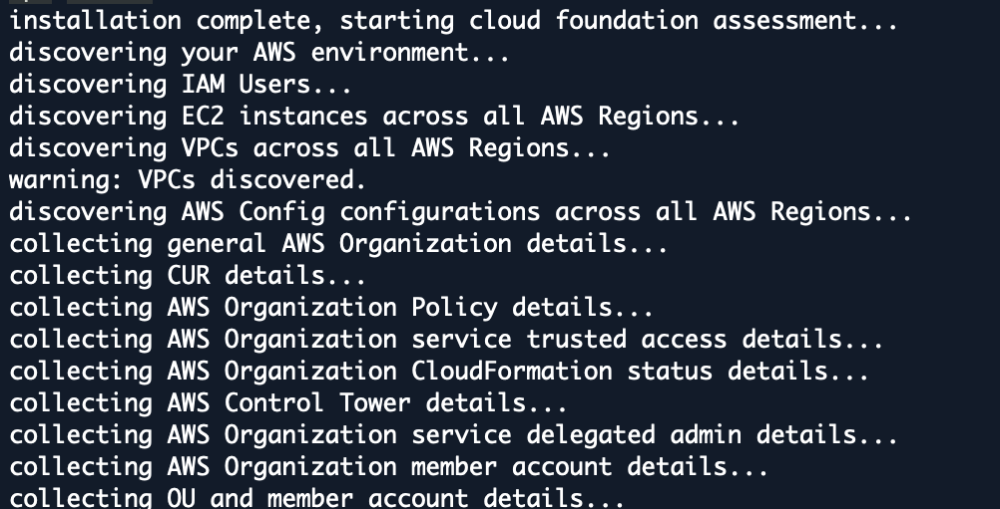

# Cloud Foundation Assessment Tool (CFAT)

CFAT is an open-source solution designed to provide automated discovery of an AWS environment and its multi-account architecture. Additionally, CFAT will review the environment, checking for common configurations and best practices for your AWS Organization. The tool will produce a backlog of tasks to complete, along with remediation guidance. CFAT is simple to execute, requiring only that it be executed within the AWS Management Account in the AWS CloudShell.

>**Note:** CFAT can operate with `READONLY` permissions **plus CloudShell permissions** to the AWS account, and does not make any changes to the AWS environment. All information generated from the tool is outputted to your local AWS CloudShell environment.

## How to Use

1. Go into an AWS account which is a `Management Account` and open CloudShell terminal.

2. Ensure you have right now admin permissions or the proper *READONLY* permissions that include ability to use AWS CloudShell
    * For least privilege readonly, leverage the IAM Managed Policies:
        - `arn:aws:iam::aws:policy/ReadOnlyAccess`
        - `arn:aws:iam::aws:policy/AWSCloudShellFullAccess`
3. Within AWS CloudShell the following command: `curl -sSL https://raw.githubusercontent.com/cloud-foundations-on-aws/cloud-foundations-templates/main/cfat/run-assessment.sh | sh`

4. Watch screen scroll through output looking for any errors.
 
5. Once done you will see the tool created a directory called ./cfat
    * verify by running `ls` in the current working directory you are in
6. The CFAT creates a zip archive containing several artifacts (see [Generated Documentation and Artifacts](#generated-documentation-and-artifacts))
7. Within the CloudShell window, go to top right of the page and click on `Actions` button and click on `Download File`
 
8. In the download file enter `./cfat/assessment.zip`
 
9. File is download which you can unzip and view the generated documentation and artifacts.

## Generated Documentation and Artifacts

Running the CFAT produces an archive assessments folder `./cfat/assessment.zip` in the current working directory you run the program from. Unzipping the archive will enable you to access 4 files which were generated during the assessment:

1. **cfat.txt** - file contains a detailed text report of the assessment. Use this file to determine work needed to be completed. An example of a generated report can be found at [./docs/cfat.txt](./docs/cfat.txt). As illustrated below, the header in the report will give you a quick status and an estimated level of effort (loe) to complete the requirements.

2. **cfat-checks.csv** - output file of the table result which is located in the detailed report (cfat.txt). The csv output is to let you organize and sort the findings. An example of a generated report can be found at [./docs/cfat-checks.csv](./docs/cfat-checks.csv)

3. **asana-import.csv** - all tasks created in a csv file format that allow you to easily import the items into your Asana managed backlog. An example of a generated import can be found at [./docs/asana-import.csv](./docs/asana-import.csv)
4. **jira-import.csv** - all tasks created in a csv file format that allow you to easily import the items into your Jira managed backlog. An example of a generated import can be found at[./docs/jira-import.csv](./docs/jira-import.csv)

## Features

* **Automated Discovery:** CFAT automates the discovery process, minimizing the need for manual checks and providing a quick overview of the environment.
* **READONLY Access:** The tool operates with READONLY access (**plus CloudShell permissions**) to the AWS account, ensuring that it does not make any modifications or interfere with the existing setup.
* **Importable Backlog:** The tool creates common project management software importable file allowing you to import CFAT findings into services like Jira and Asana.
* **AWS CloudShell Compatibility:** CFAT is designed to be executed within AWS CloudShell, providing a convenient and secure environment for running discovery.
* **Developed in JavaScript and AWS-SDK v3:** CFAT is implemented using JavaScript and relies on the latest AWS-SDK v3 for seamless interaction with AWS services.

## Security Considerations

* The tool is designed to operate with `READONLY` access (**plus permissions to run CloudShell**), minimizing the risk of unintended changes to your environment. All data is outputted into your local CloudShell environment.
