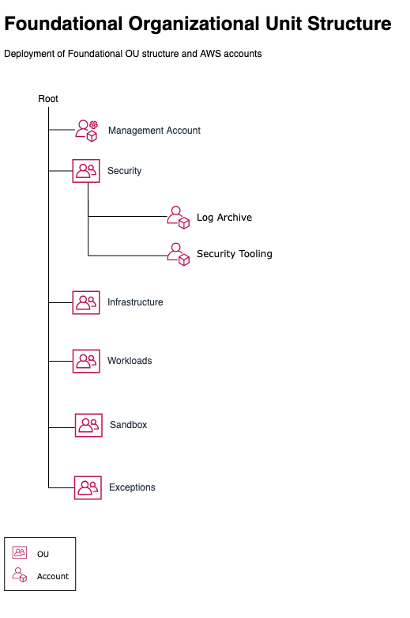

# Foundational Organizational Unit Structure and Accounts

The [foundational-organizational-unit-structure.yml](./foundational-organizational-unit-structure.yml) template deploys a basic AWS Organizational Unit structure with AWS accounts for log centralization and security tooling. By starting with a subset of the [AWS Multi-Account Strategy Recommended OUs](https://docs.aws.amazon.com/whitepapers/latest/organizing-your-aws-environment/recommended-ous-and-accounts.html), you will have an organizational structure that allows you to start building out your environment and workloads and allow you to create additional recommended OUs as they are needed.

> **Note:** Deploy the template from your [AWS management account](https://docs.aws.amazon.com/organizations/latest/userguide/orgs_getting-started_concepts.html).

The following diagram

> **Note:** the diagram is an editable PNG which can be revised for your use with draw.io application.

## CloudFormation Parameters

Deploy the template from your [AWS management account](https://docs.aws.amazon.com/organizations/latest/userguide/orgs_getting-started_concepts.html). The following parameters will need to be updated when deploying the template. Review these parameters and ensure you the necessary values needed at the time of deployment.

| Parameter | Type | Default Value | Description |
| --------- | ---- | ------------- | ----------- |
| `pRootOrgId` | String |  | Organization root Id (r-xxxx) |
| `pLogArchiveAccountName` | String | `Log Archive` | alias (AWS account name) for the production log archive account |
| `pLogArchiveAccountEmail` | String |  | root user email address for the production log archive account. Example: aws-log-archive-[org-identifier]@example.com|
| `pSecurityToolingAccountName` | String | `Security Tooling` | alias (AWS account name) for the production security account |
| `pSecurityToolingAccountEmail` | String |  | root user email address for the production security tooling account. Example: aws-security-tooling-[org-identifier]@example.com |

> **Important:** All email addresses used in the template need to be unique to AWS. The email addresses cannot be repeated or used twice when registering a new AWS account. It is also recommended to use distribution groups for root user email addresses over single user email addresses.
