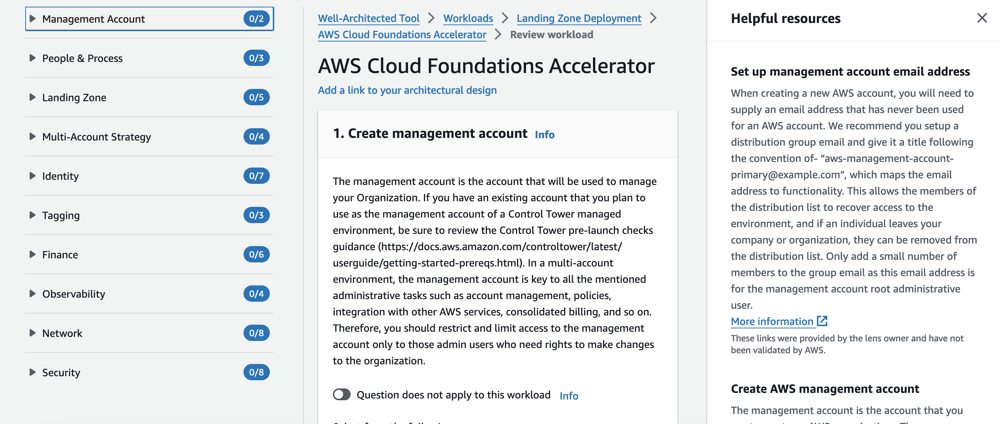
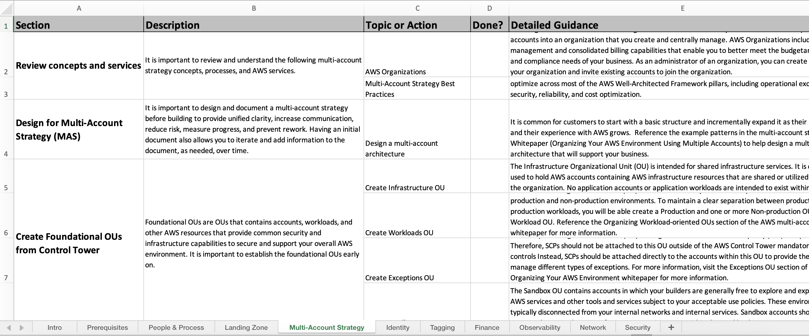

# Custom Lens

This directory contains [Well Architected Custom Lenses](https://docs.aws.amazon.com/wellarchitected/latest/userguide/lenses-custom.html) that can be used to assess and track your Cloud Foundations deployments.

Moreover, you can use this Lens as a step-by-step guide for understanding the concepts, designing and implementing your Cloud Foundations environment.

## CFA Custom Lens Usage

To automatically publish the Lens for use in your account follow the below steps.  Alternatively, you can manually deploy the Custom Lens json following the [Well Architected Custom Lenses](https://docs.aws.amazon.com/wellarchitected/latest/userguide/lenses-custom.html) guidance.

1. Log into an AWS account.  This account will be used to hold the Well-Architected Custom Lens where you can track the progress of your cloud foundation.
2. Open the CloudShell console. Copy this command and paste into the CloudShell console.  Ensure that you add in the regions that you plan to operate in: `export Regions=[AWS Region list] Owner="CFA"; curl -sSL https://raw.githubusercontent.com/cloud-foundations-on-aws/cloud-foundations-templates/main/custom-lens/auto-deploy/app.py | python3`

    Example: `export Regions="us-east-1,us-west-2" Owner="CFA"; curl -sSL https://raw.githubusercontent.com/cloud-foundations-on-aws/cloud-foundations-templates/main/custom-lens/auto-deploy/app.py | python3`

3. Navigate to the Well Architected Tool console in AWS.  Choose Workloads and select 'Organization' and then click Continue Reviewing and choose AWS Cloud Foundations Accelerator.

## Exporting CFA Lens to a Microsoft Excel Workbook

"Tools" folder contains a [Microsoft Excel File](cloud-foundations-accelerator-workbook.xlsx), which is automatically generated out of CFA Lens JSON on each update. This file is formatted as a Project Workbook and can be used to track activities and CFA module completion instead/on top of CFA Lens execution using a Well-Architected Tool Console. 

## Content

| Custom Lens | Description | Type |
| --------------- | ----------- | ---- |
| [Cloud Foundations Accelerator Custom Lens](./cloud-foundations-accelerator-custom-lens.json) |  Custom Lens to measure and track your progress as you complete the core Cloud Foundations capabilities. This Custom Lens goes into greater depth than the Acceleration Day Custom Lens | [Custom Lens](https://docs.aws.amazon.com/wellarchitected/latest/userguide/lenses-custom.html) |
